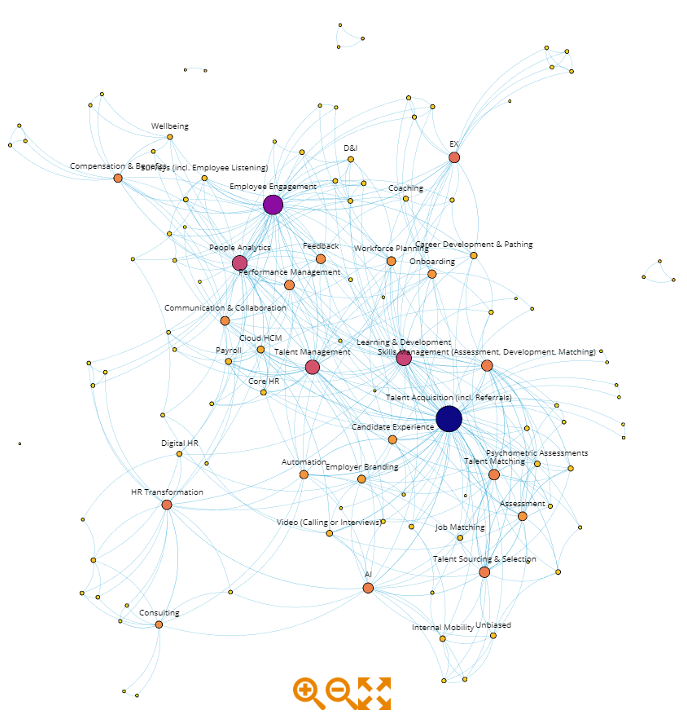

```{r setup, include=FALSE}
knitr::opts_chunk$set(echo = FALSE)
```


```{r header, echo=FALSE, fig.cap="Photo by [JJ Ying](https://unsplash.com/@jjying) on [Unsplash](https://unsplash.com/).", out.width = "100%"}
knitr::include_graphics("hrtechanalysis_files/jj-ying-8bghKxNU1j0-unsplash.jpg")

```


## Data collection

We obtained data from the 2019 Unleash Conference in London, specifically the 35 start-ups and 64 sponsors that were present at the conference. Conference attendees were provided a list of company names and their “tags”, which were descriptors of the technology or HR domain that characterize the respective companies.


## Network Analyses — How we did what we did?

We examined the tags using network analysis, in a technology called [Kenelyze](https://www.kenelyze.com/) (kudos to our partner [André Vermeij](https://www.linkedin.com/in/andrevermeij/)).

The current network examines the “influence” of HR tech among those vendors present at the 2019 Unleash Conference in London. Network Nodes were the company Tags, and company name was included as a node attribute. The network was undirected and displayed using the Force Atlas 2 layout. Nodes (i.e. Tags) were sized according to the number of times the Tag was used to describe an organization, and coloured according to the PageRank score (i.e. influence measure). The network is presented below in static format. However, you can also view an interactive network by clicking on either the network image below, or the following [LINK.](https://www.kenedict.com/networks/hr_tech/) Please feel free to explore further and comment!




Network Output of Analysis of HR Tech at 2019 Unleash Conference in London
[https://www.kenedict.com/networks/hr_tech/](https://www.kenedict.com/networks/hr_tech/)


## Data interpretation: What did we discover? / What are main insights?

# What are prominent technologies in the HR Tech landscape?

### 1. Talent acquisition is a main influencer

The most frequent Tag, most connected to other Tags, and most influential was “Talent Acquisition (incl. Referrals)”. It is perhaps unsurprising that Talent Acquisition is both a common and influential domain in HR Technology. This may in part reflect the discrete nature of the recruiting process, characterized by a definitive start and end point, and a clear, binary success measure—hired or not hired. In addition, Talent Acquisition also lends itself to performance measurement, evidenced by metrics such as source of hire, time to hire, applicants per hire, cost per hire, offer acceptance per hire, etc. All discrete metrics that the technology domain has progressively digitized. Good news for Talent Acquisition functions, what about the rest of us?


### 2. People Analytics and Employee Experience are “up and coming”

Following Talent Acquisition the next most frequent and influential Tags included Employee Engagement, Learning & Development, People Analytics, Talent Management, and Employee Experience (EX). These Tags reflect what we interpret as a mix of established HR domains (e.g. Employee Engagement, Learning & Development, Talent Management, HR Transformation), and “up and coming” (e.g. People Analytics and EX). The latter two topics have experienced a meteoric rise in prominence in recent years. However, both People Analytics and EX we anecdotally know to be technology related, and both benefit from a historical connection to data collection network nodes such as “Employee Engagement” and “Surveys (incl. Employee Listening)”.

We note two points about People Analytics and EX—first, their collective network metrics and second, the various companies that identify themselves with these two capabilities (i.e. click on nodes to see company listings). To us the network metrics and network position suggest that People Analytics is currently more influential (e.g. frequency, degree, PageRank), more central to the network (i.e. position), and consequently likely to play a more significant role in connecting technologies in the HR Tech landscape in the immediate future. Longer term, only time and repeated assessment of the market will tell.

Secondly, the companies identifying themselves with these two capabilities are varied! Our interpretation of this variation is that the terms People Analytics and EX (also applicable to “Workforce Planning”) mean many things to different people, perhaps driven by maturity of practice in the consumer population. Alternatively, it may also represent future use cases that aren’t currently mainstream, or the potential for partnership or acquisition among technology vendors. Finally, it may represent opportunistic thinking by marketing professionals! 


### 3. Skills are the new currency

A special call out to the topic of Skills Matching, which we at Merck KGaA have invested in during 2019, and will further explore in 2020. As evidenced in the network, we believe there is real world connectivity between Skills Matching and domains such as People Analytics (our team currently owns the Skills Matching topic at Merck KGaA), Strategic Workforce Planning (i.e. bridging the current with the future), Talent Management, Learning & Development (i.e. to get from the present to the future what training interventions are required), Talent Sourcing (incl. Referrals), and Performance Management (i.e. among other things a useful source of data to inform Skills Matching!). As referenced in recent predictions for 2020 by a variety of authors (e.g. [David Green](https://www.linkedin.com/pulse/putting-h-back-hr-10-predictions-2020-david-green/), [Visier](https://hello.visier.com/hr-trends-2020-ebook/), [Bersin](https://joshbersin.com/hr-and-talent-predictions-for-2020/), etc.), we believe that “Skills are the new currency”! Kudos to [Ian Bailie](https://www.linkedin.com/in/ianbailie/) for one of our favourite stakeholder pitch lines.


### 4. Social Networks appear niche

Tech Tags that appeared less frequently than expected, at least considering public hype, included Digital HR and Social Networks. This may simply reflect the companies present at Unleash 2019. However, it may also be suggestive of the niche nature of this technology / approach, and the slow rate of adoption among companies due to various reasons (e.g. data privacy implications, prevalence of skills, lack of available use cases, etc.).


## Next Steps

The analysis provides a data driven exploration of the HR Tech landscape present at Unleash London in 2019. While the dataset does not claim to capture the universe of HR Tech, it does provide an interesting perspective of available technologies and how these technologies relate to one another. We encourage further exploration of the interactive network—reflect on your own hypotheses, look at the edges for new trends, examine the network structure, and consider what it might mean for the future. To make the article digestible we intentionally did not address many relationships in the network.

We welcome your comments, particularly additional interpretation of the network, that may generate insights and practical value for other readers. Stay tuned! We may look to squeeze further insights from this analysis (e.g. different algorithms, node configurations, etc.).

