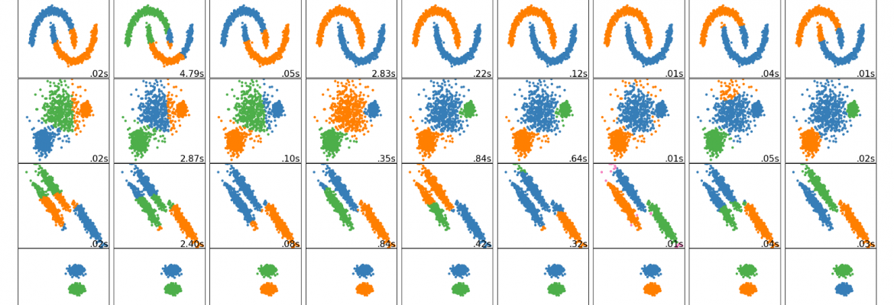

```{r setup, include=FALSE}
knitr::opts_chunk$set(
  echo = TRUE,
  warning = FALSE,
  message = FALSE,
  comment = "##",
  R.options = list(width = 70)
)
```


```{r image_header, echo=FALSE, fig.cap="Image source: Clustering: scikit-learn.org", out.width = "100%"}

```


We recently published an article titled [**"A Beginner's Guide to Machine Learning for HR Practitioners"**](https://www.linkedin.com/pulse/beginners-guide-machine-learning-hr-practitioners-adam-mckinnon/) where we touched on the three broad types of Machine Learning (ML); reinforcement, supervised, and unsupervised learning. In this follow-up article we will explore unsupervised ML in more depth. We will demonstrate how we use cluster analysis, a form of unsupervised ML, to identify similarities, patterns, and relationships in datasets intelligently (like humans – but faster or more accurately). We have included some practical code written in R. Let’s get started!


## Cluster Analysis in HR
The objective we aim to achieve is an understanding of factors associated with employee turnover within our data. To do this, we form clusters based on a set of employee variables (i.e., Features) such as age, marital status, role level, and so on. The clusters help us better understand the many attributes that may be associated with turnover, and whether there are distinct clusters of employees that are more susceptible to turnover. This last insight can facilitate the personalising of the employee experience at scale by determining whether current HR policies are serving the employee clusters identified in the analysis, as opposed to using a one size fits all approach.


# 1. Importing the Data
We begin by loading the R packages we will need for the analysis. The dataset we have used for our example is publicly available – it’s the IBM Attrition dataset. You can download it [**here**](https://www.kaggle.com/pavansubhasht/ibm-hr-analytics-attrition-dataset/) if you would like to follow along.

```{r data}

library(tidyverse) # data workhorse
library(readxl) # importing xlsx files
library(correlationfunnel) # rapid exploratory data analysis
library(cluster) # calculating gower distance and PAM
library(Rtsne) # dimensionality reduction and visualization
library(plotly) # interactive graphing
library(DT) # interactive tables


set.seed(175) # reproducibility

hr_data_tbl <- readxl::read_xlsx("clusteranalysis_files/datasets_1067_1925_WA_Fn-UseC_-HR-Employee-Attrition.xlsx")

```


# 2. Selecting Variables for Clustering
Under normal circumstances, we would spend time exploring the data – examining variables and their data types, visualising descriptive analyses (e.g., single variable and two variable analyses), understanding distributions, performing transformations if needed, and treating missing values and outliers. 

However, for the sake of simplicity, we will skip this and instead just calculate the correlation between attrition and each variable in the dataset. Those variables with a correlation of greater than 0.1 will be included in the analysis. This is useful for several reasons, but most importantly to decide which variables to include for our cluster analysis.

Keep in mind that when it comes to clustering (or any other method), including more variables does not always mean a better outcome—simplicity should be the goal. Including more variables can complicate the interpretation of results and consequently make it difficult for the end-users to act upon results.


```{r correlation_funnel}

hr_corr_tbl <- hr_data_tbl %>%
    
  # remove the Employee Number variable from the correlation analysis
    dplyr::select(-EmployeeNumber) %>%
    
    # binarize cotinuous variables and one hot encode factors
    correlationfunnel::binarize(n_bins        = 5, 
                                thresh_infreq = 0.01, 
                                name_infreq   = "OTHER", 
                                one_hot       = TRUE) %>%
    
    # correlate all variables with Attrition
    correlationfunnel::correlate(Attrition__Yes)


hr_corr_tbl %>%
    # plot the correlation
    correlationfunnel::plot_correlation_funnel(interactive = TRUE)
    

```


By using our correlation value of 0.1 as a cutoff, the analysis suggests the inclusion of fifteen variables for clustering: from overtime to business travel. In preparation for the analysis, any of these fifteen variables which are of a character data type (e.g. MaritalStatus = Single) are converted to a factor datatype (more on this below).


```{r}

# select the variables we wish to include in the analysis
var_selection <- c("EmployeeNumber", "Attrition", "OverTime", 
                   "JobLevel", "MonthlyIncome", "YearsAtCompany", 
                   "StockOptionLevel", "YearsWithCurrManager", 
                   "TotalWorkingYears", "MaritalStatus", "Age", 
                   "YearsInCurrentRole", "JobRole", "EnvironmentSatisfaction",
                   "JobInvolvement", "BusinessTravel")


hr_subset_tbl <- hr_data_tbl %>%

    # select our variables listed above
    dplyr::select(one_of(var_selection)) %>%
  
    # convert the character variables to factors
    dplyr::mutate_if(is.character, as_factor) %>%
  
    # recorder the variables
    dplyr::select(EmployeeNumber, Attrition, everything())

```


# 3. Analysis: Gower Distance
In essence, clustering is all about determining how similar (or dissimilar) cases in a dataset are to one another so that we can then group them together. To do this we first need to give each case (i.e., employee) a score based on the fifteen variables selected and then determine the difference between employees based on this score. 

The most common way of performing this activity is by calculating the “Euclidean Distance”. However, Euclidean Distance is effective when analysing continuous variables (e.g., age, salary, tenure), and thus is not suitable for our HR dataset, which includes ordinal (e.g., EnvironmentSatisfaction – values from 1 = worst to 5 = best) and nominal data types (MaritalStatus – 1 = Single, 2 = Divorced, etc.). Therefore, we have to use a distance metric that can handle different data types; the Gower Distance.

The main advantage of Gower Distance is that it is simple to calculate and intuitive to understand. However, the disadvantage of this method is that it requires a distance matrix, a data structure that compares each case to every other case in the dataset, which needs considerable computing power and memory for large datasets.


```{r gower}

# Compute Gower distance and covert to a matrix
gower_dist <- cluster::daisy(hr_subset_tbl[, 2:16], metric = "gower")
gower_mat <- base::as.matrix(gower_dist)


```


We can perform a sanity check on our distance matrix by determining the most similar and/or dissimilar pair of employees. Here we calculate the two most similar employees according to their Gower Distance score.


```{r sanity_check}

# Print most similar employees 
similar_tbl <- hr_subset_tbl[which(gower_mat == min(gower_mat[gower_mat != min(gower_mat)]), 
                                   arr.ind = TRUE)[1, ], ]


# Transform the results to a datatable and save as a png file 
similar_employees <- similar_tbl %>%

    # convert to a datatable
    DT::datatable(rownames = FALSE, caption = 'Table of two most similar employees',
                options = list(
                                columnDefs = list(list(className = 'dt-center', 
                                                       targets   = 0:15)),
                                dom            = 't',
                                scrollX        = TRUE,
                                scrollCollapse = TRUE)) 


similar_employees

```


We learn from our sanity check in the table above that EmployeeID 1624 and EmployeeID 614, let’s call them Bob and Fred, are considered to be the most similar in the dataset. Looking at the table we can see that their values for fourteen of the fifteen variables are identical – only monthly salary differs slightly. The Gower Distance seems to be working and the output makes sense, now let’s perform the cluster analysis to see if we can understand turnover.


# 4. Analysis: How many Clusters?
The one big question that must be answered when performing cluster analysis is “how many clusters should we segment the dataset into?” 

We can use a data-driven approach to determine the optimal number of clusters by calculating the silhouette width. With this metric, we measure how similar each observation (i.e., in our case one employee) is to its assigned cluster, and conversely how dissimilar it is to neighbouring clusters. The metric can range from -1 to 1, where values of 1 show a clear cluster assignment, 0 suggests weak cluster assignment (i.e., a case could have been assigned to one of two neighbouring clusters) and -1 wrong cluster assignment.


```{r cluster_number}

# perform the cluster analysis multiple times with different numbers of clusters
sil_width <- purrr::map_dbl(2:10, function(k){
  model <- cluster::pam(gower_dist, k = k)
  model$silinfo$avg.width
})


# create a tibble with each row representing the cluster number 
# and average silhouette width
sil_tbl <- tibble::tibble(
  k = 2:10,
  sil_width = sil_width
)


# visualize the clusters numbers and average silhouette width to 
# identify the optimal number of clusters
fig2 <- ggplot2::ggplot(sil_tbl, aes(x = k, y = sil_width)) +
  geom_point(size = 2) +
  geom_line() +
  scale_x_continuous(breaks = 2:10)


plotly::ggplotly(fig2)

```


To identify the number of clusters with the highest average silhouette width, we perform the cluster analysis with differing numbers of clusters. In our case we choose two through to ten clusters. The reason we limited the maximum number of clusters to ten is that the larger numbers become the more difficult it becomes to interpret and ultimately act upon. As can be seen from the graph, six clusters generated the highest average silhouette width and will therefore be used in our analysis.


It is important to note that the average silhouette value (0.14) is actually quite low. According to anecdotal evidence, we would ideally want, at a minimum, a value between 0.25 and 0.5 (see [Kaufmann and Rousseuw, 1990](https://onlinelibrary.wiley.com/doi/book/10.1002/9780470316801)). Our low value might be indicative of limited structure in the data, or some clusters being weaker than others (i.e., some clusters group loosely, while others group tightly). To better understand the low value we have opted to look at the practical insights generated by the clusters and to visualise the cluster structure using t-Distributed Stochastic Neighbour Embedding (t-SNE). Both of these are explained below.


# 5. Analysis: Interpreting the Clusters
A topic we have not addressed yet, despite having already performed the clustering, is the method of cluster analysis employed. 

In this analysis, we used the Partitioning Around Medoids (PAM) method. This method is identical to K-Means which is the most common form of clustering practiced. The only difference is that cluster centres for PAM are defined by the raw dataset observations, which in our example are our fifteen variables. This PAM approach has two key benefits over K-Means clustering. Firstly, it is less sensitive to outliers (e.g., such as a very high monthly income). Secondly, PAM also provides an exemplar case for each cluster, called a “Medoid”, which makes cluster interpretation easier.

With that this in mind, let’s re-run the cluster analysis with 6 clusters, as informed by our average silhouette width, join the cluster analysis results with our original dataset to identify into which cluster each individual falls, and then take a closer look at the six Medoids representing our six clusters.

```{r}

# set the number of clusters
k <- 6


# rerun the cluster analysis with 6 clusters
pam_fit <- cluster::pam(gower_dist, diss = TRUE, k)


# add the cluster assignment to each employee
hr_subset_tbl <- hr_subset_tbl %>%
    dplyr::mutate(cluster = pam_fit$clustering) 


# have a look at the Medoids to understand the clusters
hr_subset_tbl[pam_fit$medoids, ] %>% 
    
    # add the cluster column to the front
    dplyr::relocate(cluster, everything()) %>% 
    
    # convert to a datatable, ensuring all rows are visible
    DT::datatable(rownames = FALSE, caption = 'Cluster Medoids',
                options = list(
                                columnDefs = list(list(className = 'dt-center', 
                                                       targets   = 0:16)),
                                dom            = 't',
                                scrollX        = TRUE,
                                scrollCollapse = TRUE)) 

```


The Medoids, which are the exemplar cases (i.e., employee) for each cluster, are presented in the table above. These Medoids can be useful in the creation of Persona's if we were looking to operationlise results (discussed below).

To better understand attrition in our population we calculated the rate of attrition in each cluster, and how much each cluster captures overall attrition in our dataset.

```{r attrition_rate}

attrition_rate_tbl <- hr_subset_tbl %>%

    # select our cluster number and attrition variables
    dplyr::select(cluster, Attrition) %>%

    # create a numeric representation of attrition
    dplyr::mutate(attrition_num = forcats::fct_relevel(Attrition, "No", "Yes") %>% 
                    base::as.numeric() - 1) %>%

    # group by cluster and then calculate cluster metrics
    dplyr::group_by(cluster) %>%
    dplyr::summarise(
        Cluster_Turnover_Rate  = (base::sum(attrition_num) / base::length(attrition_num)) %>%
                                  scales::percent(accuracy = 0.1),
        Turnover_Count = base::sum(attrition_num),
        Cluster_Size = base::length(attrition_num)
    ) %>%
    dplyr::ungroup() %>%

    # calculate population metrics
    dplyr::mutate(Population_Turnover_Rate = (Turnover_Count / base::sum(Turnover_Count)) %>%
                                              scales::percent(accuracy = 0.1))


attrition_rate_tbl %>% 
      
    # convert to a datatable, ensuring all rows are visible
    DT::datatable(rownames = FALSE, caption = 'Cluster Attrition Rates',
                options = list(
                                columnDefs = list(list(className = 'dt-center', 
                                                       targets   = 0:4)),
                                dom = 't')) 

```


It is now evident that almost 80% of employees in Cluster 3 left the organisation, which represents approximately 60% of all turnover recorded in the entire dataset. Great! Our identified clusters appear to generate some groupings clearly associated with turnover. Based on this we can gather a descriptive understanding of the combination of variables associated with turnover.

Unfortunately, our code-based output up to this point is more attuned to data analysts than business partners and HR stakeholders. To make the results more digestible and actionable for non-analysts we will visualise them. 

One way to collectively visualise the many variables from our cluster analysis together is with a method called t-SNE. This method is a dimensionality reduction technique that seeks to preserve the structure of the data while reducing it to two or three dimensions—something we can visualise! Technically, this step is not necessary but is recommended as it can be helpful in facilitating the understanding of results and thereby increasing the likelihood of action taken by stakeholders. In addition, it enables us to better understand the cluster structure, which was identified as weak by our average silhouette width metric.

We first create labels for our visualisation, perform the t-SNE calculation, and then visualise the t-SNE output.

```{r tsne, layout="l-body-outset", fig.width=8, fig.height=5}

# create the labels for the t-SNE visualisation
data_formatted_tbl <- hr_subset_tbl %>%
    dplyr::left_join(attrition_rate_tbl) %>%
    dplyr::rename(Cluster = cluster) %>%
    dplyr::mutate(MonthlyIncome = MonthlyIncome %>% scales::dollar()) %>%
    dplyr::mutate(description = stringr::str_glue("Turnover = {Attrition}
    
                                  MaritalDesc = {MaritalStatus}
                                  Age = {Age}
                                  Job Role = {JobRole}
                                  Job Level {JobLevel}
                                  Overtime = {OverTime}
                                  Current Role Tenure = {YearsInCurrentRole}
                                  Professional Tenure = {TotalWorkingYears}
                                  Monthly Income = {MonthlyIncome}
                                  
                                  Cluster: {Cluster}
                                  Cluster Size: {Cluster_Size}
                                  Cluster Turnover Rate: {Cluster_Turnover_Rate}
                                  Cluster Turnover Count: {Turnover_Count} 
                                  "))


# map the clusters in 2 dimensional space using t-SNE
tsne_obj <- Rtsne::Rtsne(gower_dist, is_distance = TRUE)


# transform the rtsne object to a tibble and reformat data for visualization
tsne_tbl <- tsne_obj$Y %>%
    tibble::as_tibble() %>%
    dplyr::rename("X" = 1, "Y" = 2) %>%
    dplyr::bind_cols(data_formatted_tbl) %>%
    dplyr::mutate(Cluster = Cluster %>% forcats::as_factor())


# visualize the data as a scatter plot using ggplot
g <- tsne_tbl %>%
    ggplot2::ggplot(aes(x = X, y = Y, colour = Cluster, text = description)) +
    geom_point()


# make the plot interactive with plotly
plotly::ggplotly(g, tooltip = "text")

```


The plot allows us to graph our cluster analysis results in two dimensions, enabling end-users to visualise something that was previously code and concepts.

As suggested earlier by the average silhouette width metric (0.14), the grouping of the clusters is “serviceable”. There are some cases in each cluster that appear distant to the other cases in the cluster, but generally, the clusters appear to somewhat group together (Cluster 4 appears the weakest performer). On a practical note, it was reassuring that 80% of cases captured by Cluster 3 related to employee turnover, thereby enabling us to achieve our objective of better understanding attrition in this population.

### Persona's

When viewing the above visualisation we can hover over any dot in our visualisation and find out about its cluster membership, cluster turnover metrics, and the variable values associated with the employee. When we hover over cases in Cluster 3, we see variables associated with employees that are similar to our Cluster 3 Medoid, younger, scientific & sales professionals, with a few years of professional experience, minimal tenure in the company, and that left the company. We are beginning to develop a “Persona” associated with turnover, meaning that turnover is no longer a conceptual problem, it’s now a person we can characterise and understand. 

Ideally, this knowledge enables us to develop tailored interventions and strategies that improve the employee experience within the organisation and reduce the risk of unwanted turnover. The biggest benefit we gain from performing a cluster analysis as we just did is that intervention strategies are then applicable to a sizable group; the entire cluster, thus making it more cost-effective and impactful.

In addition, the analysis also shows us areas of the employee population where turnover is not a problem. This information may also be valuable when reviewing our employee offerings (e.g., policies and practices) and how well these offerings address turnover among our six clusters / personas. Furthermore, it can also influence the way in which we invest in future employee experience initiatives and our employee strategy in general.


# A final note
In this instance, we have demonstrated the process for performing cluster analysis (Unsupervised ML) using a mixture of data types to understand the topic of turnover in an HR dataset. Cluster analysis, while not a panacea for every HR problem, is a powerful method for understanding topics and people in HR, which can inform the way in which HR practitioners pragmatically scale personalised employee experiences and move away from a one size fits all approach.


**Happy Clustering!**


## Acknowledgments {.appendix}
This article was first published on the Analytics In HR (AIHR) website under the title ["A Tutorial on People Analytics Using R – Clustering"](https://www.analyticsinhr.com/blog/people-analytics-r-clustering/?utm_source=linkedin&utm_medium=social&utm_campaign=blog&utm_content=ac-r-clustering)on July 13, 2020. The original version can be viewed here.
