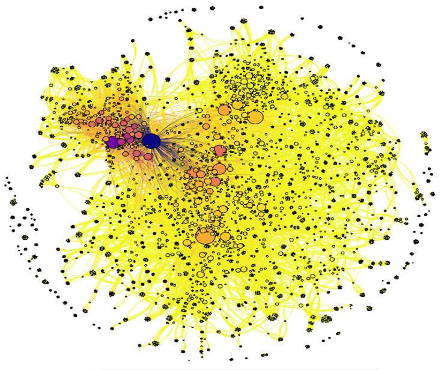
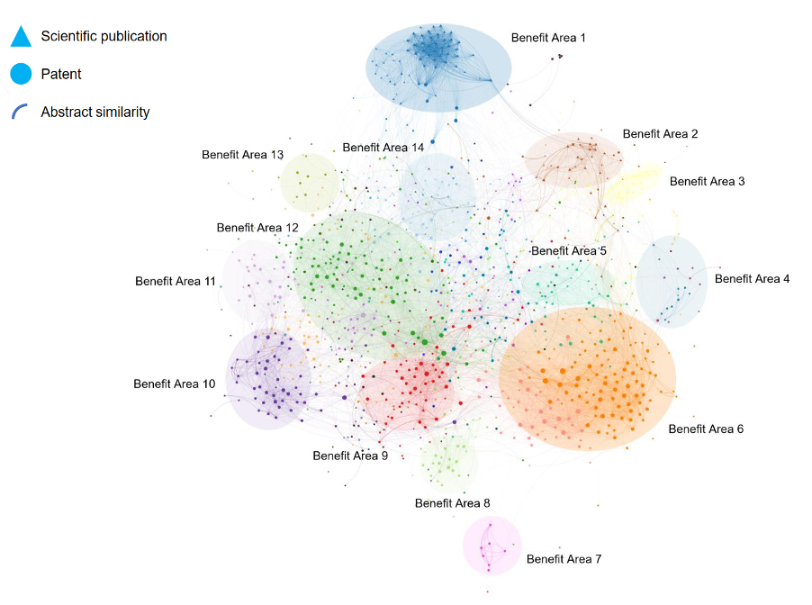

```{r setup, include=FALSE}
knitr::opts_chunk$set(echo = FALSE)
```


```{r header, echo=FALSE, fig.cap="Photo by [Matt Palmer](https://unsplash.com/@mattpalmer) on [Unsplash](https://unsplash.com/).", out.width = '100%'}

```


This article explores: 

* The value of moving from a purely internal network view (a potential limitation of Organisational Network Analysis) to a view that includes external network analysis as well.

* How Network Analysis can be applied to a variety of datasets to generate unique people analytics insights for organisations.

* The value of applying Network Analysis to “Open” (i.e. publicly available) data sources to inform people-related decisions inside organisations.

* Practical use cases of how HR can inform decisions by applying network analysis to open data.


# Why “Network Analysis” could be more valuable than “Organisational Network Analysis”

Organisational Network Analysis (ONA) has received considerable attention in recent years within People Analytics circles globally, as illustrated by the public discussion and proliferation of companies specialising in this method. There is an appetite to learn and do more, which also speaks to the quality and actionability of insights generated. Typical ONA benefits include, for example, improved collaboration through a better view on intra- and inter-team collaboration and the identification of key individuals acting as hubs and connectors for efficient message broadcasting during change management initiatives.

ONA traditionally denotes the analysis of social interactions internally to inform organisational decision making. We have seen exceptional examples of this work published in the public domain from people like Michael Arena, Rob Cross, Manish Goel and many others. These are important examples; however, we could be imposing a false barrier upon practitioners by focusing too much on the ‘O’ for Organisational. While the term ONA is directionally accurate, it limits our thinking and actions regarding the breadth of possible applications for network analysis. In other words, we are limiting the data sources we could use and the questions we could answer by only looking internally, within the organisation.

In academic circles, this work is often referred to as “Social Network Analysis” (SNA) and can be found in a body of literature that spans decades. SNA broadens the perspective of the discussion by using network analysis to understand social interactions. In doing so, it has generated a wealth of insights around social relationships in the fields of sociology, psychology and anthropology. There are however, once again, limitations. The field is limited to solely represent social connectedness (connections between individuals, teams, or entire companies), as opposed to simply connectedness (connections between any other type of data point – for example documents, projects, skills, knowledge areas, etc.). In a society of ever-increasing digitisation and data generation, insights into this broader concept of connectedness are of increasing value. 

Network analysis can be applied to a variety of data types and data sources in a bid to understand this kind of broad connectedness between data, as opposed to just connections between people. Since the early 2000s, the broader scientific fields of Network Science and Complex Networks have been focusing on applying large-scale network analysis in a wide variety of other domains as well, including, for example, biology (cellular networks), neurology (brain networks), economics (corporate governance, trade networks) and finance (transaction networks, fraud detection).

The People Analytics field should therefore embrace the name “Network Analysis” as opposed to “Organisational Network Analysis” in order to shed the limitations imposed by the domain specific names that have previously dominated public discussion in the field, and subsequently broaden the opportunity for People Analytics practitioners to generate unique insights.


# What data is available for network analysis, beyond the traditional sources?

Traditional discussion of network analysis has focused on active (i.e. data collection through surveys) and passive data (i.e. data collection through meta-data stored such as email). Both sources of data are focused on social interactions and can generate valuable insights when applied singularly or in concert. 

Some limited discussion has been offered on the topic of behavioural network data—capturing social interaction data from electronic devices or badges worn by individuals (i.e. arguably a mix of active and passive approaches – an approach used by Humanyze).

In addition to the above three, it is our belief that a fourth source of data exists - Open Data. [Open Data](https://theodi.org/article/what-is-open-data-and-why-should-we-care/) refers to data that is publicly available for anyone to access, use and share. Excellent examples of major governmental open data sources include the [European Data Portal](https://www.europeandataportal.eu/en), [Data.gov](https://www.data.gov) (US) and [Data.gov.uk](https://data.gov.uk) (UK).

The benefits of Open Data are that it is:

* often free

* not as often limited by data privacy regulations, which means the data is faster to execute on

* a valuable training tool for analysts

* able to provide an “outside in” perspective

[Kaggle](https://kaggle.com) is a website oriented towards the data science community and offers a wide variety of datasets as well, but these are often focused on specific use cases and hard to use for insights for specific organisations or individuals. A major benefit of more general open data sources, like those mentioned above, is that the insights which can be gained from them can be directly applicable and valuable in a practical context as well.


# Where can I find Open Data sources?

Rich and openly available datasets are available in a wide variety of contexts. Finding the right data sources for your network analysis activity often starts with answering the following questions:

* In which subject category or application area am I looking for insights?

* Within this area, which types of data points and connections between them are most interesting for my analysis?

* Which open data sources contain these types of data and what is the quality of these data sources? It’s important to assess these characteristics:

  * Structure / format

  * Cleanliness

  * Size

  * Recency / update frequency

For example, when we are analysing knowledge and innovation, open data on patent activity, journal articles, research grants, start-up activity, clinical trials and conference attendance are very valuable to gain a view on the connectedness between organisations, people and topics of interest. The structured metadata available in these open data sources are usually very rich, and it is often possible to generate multiple valuable networks using the same dataset. For example, one can use author and institutional affiliation information on documents to create various types of collaboration networks but can also create networks of connected documents by looking at shared characteristics, keywords or text.


## Combining datasets to add even more value

Analyses based on open data can become particularly powerful when datasets are combined in a meaningful way. If you’re working with various types of documents (let’s say patents and journal articles), you can use metadata which is common to both datasets to link them together and generate combined network overviews. Document summaries/abstracts and author information are good examples of columns which can be used to link datasets.


# Three practical use cases

The analyses in the examples below were carried out using Kenelyze, a visual analytics platform which allows anyone to create interactive network visualisations using any dataset.

### 1. Recruiting through Journal Articles

**Data sources: journal articles**

Locating external talent with very specific, scarce technical expertise can be challenging when using traditional recruitment channels. Kenelyze supported a globally operating business active in the agricultural sector with a data-driven analysis for the identification of talent in an area of interest using journal article data, specifically authorship collaborations, and applied network analysis to identify key opinion leaders.

We first collected relevant data based on keyword searches in publication databases, and then constructed networks of collaborating scientists to identify key players (often professors) and the teams surrounding them (including recently graduated postdoctoral researchers and PhD students). This enabled Hiring Managers to locate previously unknown pockets of potential talent at various universities and research institutes around the world. In addition, the analysis provided an assessment of the professional maturity of identified talent, generating insights that could thereby focus their overall recruitment strategy and actions in this space.

**Results:**

* Identification of unknown potential talent

* Assessment of professional maturity of talent

* More focused recruitment strategy and follow-up


```{r image0, echo=FALSE, fig.cap="Journal article authorship network informing the identification of scientific talent.", out.width = '100%'}

```


### 2.  Talent Retention during M&A using Patent Data.

**Data sources: patent documents**

Network analysis was applied to patent data during a corporate acquisition of a technology company. Employee data was not available prior to the close of the acquisition, making preparations for people integration activities difficult. However, the company had generated many new technologies and filed numerous patents over the last 15 years, with each patent listing inventors who were employees at the company.

Network analysis of the acquired company’s patent data identified: (1) prolific inventors in the company’s scientific teams, (2) socially influential scientists and (3) (by combining the first two points) current and future leadership talent in the technical domains and the scientists that must be retained with the resources available. 

Another outcome of the analysis, due to the data source utilised, was a listing of the different technologies (e.g., materials, methods, etc.) that each scientist has exposure to, thereby powering the generation of a technical profile of scientific talent within the acquired entity. Finally, patent categorisation data listed on patents for both the acquiring and acquired organisations were analysed collaboratively to identify shared technical domains in which the companies have developed technologies, and the employees associated with such inventions. This data could inform the systematic bringing together of experts and teams, thereby informing future organisational design of the integrated companies.

**Results:**

* Identification of leadership talent and key employees

* Generation of technical profiles

* Identification of shared technical domains for future organisational design of integrated companies


```{r image1, echo=FALSE, fig.cap="Patent categorisation code network identifying shared technical domains to inform talent decisions.", out.width = '100%'}
knitr::include_graphics("networkanalysisopendata_files/patent_network.png")
```


### 3. Analysing Text Similarity to drive Innovation

**Data sources: patents and journal articles combined in one dataset**

Network analysis and text analytics based on Natural Language Processing (NLP) go hand in hand. We worked with a major business active in the Food Ingredients industry in the Netherlands to help them get a data-driven view of new application areas for one of their key ingredients. Based on a combination of patents and journal articles joined in the same dataset, we created a total of three network perspectives which allowed the client to focus on: (1) key topics and the connections between them in document text similarity networks, (2) organisational collaboration networks, and (3) individual expert networks. The document networks were created by calculating similarities between document abstracts using NLP techniques. Subsequent visualisation of these textual similarities in networks is a powerful way to gain a view on any topic. Since static visualisations do not do justice to the power of network analyses, the networks were delivered as interactive visuals to enable the client to explore the output and gain further insights.  

**Results:**

* Gain new insights into practical application areas for their products

* Help to shape their innovation strategy going forward


```{r image2, echo=FALSE, fig.cap="Text similarity network for identification of technology benefit areas.", out.width = '100%'}

```


# In conclusion…


Using the broader term Network Analysis instead of ONA/ SNA opens up the opportunity to understand connectivity between data in many other contexts external to the organisation as well, leading to new insights and benefits

Open Data, as opposed to traditional data sources, are quicker to collect and analyse, cheaper to obtain, analyse and deploy findings, and provide organisations with an “outside in” perspective.

Examples illustrate that there are many unique ways in which Network Analysis can add value to people-related decisions in organisations. The limits of this type of analysis will be defined by our collective imagination!


## Acknowledgments {.appendix}
This article was first published on the myHRfuture website under the title ["How HR can Apply Network Analysis to Open Data"](https://www.myhrfuture.com/blog/2020/8/12/how-hr-can-apply-network-analysis-to-open-data) on August 13, 2020. 