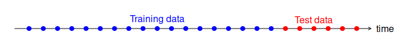

```{r setup, include=FALSE}
knitr::opts_chunk$set(echo = TRUE)
```


```{r image0, echo=FALSE, fig.cap="Photo by [Chris Liverani](https://unsplash.com/@chrisliverani) on [Unsplash](https://unsplash.com/).", out.width = "100%"}
knitr::include_graphics("chris-liverani-dBI_My696Rk-unsplash.jpg")

```

The last 9 months have, more than ever, emphasized the importance of knowing what is coming. In this article, we take a closer look at forecasting. Forecasting can be applied to a range of HR-related topics. We will specifically examine how forecasting models can be deployed in R, using an example analysis on the rise in popularity of “people analytics”.

## The goal is to know what’s coming…
Predictions come in different shapes and sizes. There are many [**Supervised Machine Learning**](https://www.analyticsinhr.com/blog/machine-learning-hr/) algorithms that can generate predictions of outcomes, such as flight risk, safety incidents, performance and engagement outcomes, and personnel selection. These examples represent the highly popular realm of “Predictive Analytics”. 

However, a less mainstream topic in the realm of prediction is that of “Forecasting” – often referred to as Time Series Analysis. In a nutshell, forecasting takes values over time (e.g., closing price of a stock over 120 days) to forecast the likely value in the future. 

The main difference between supervised machine learning and forecasting is best characterized by the data used. Generally, forecasting relies upon historical data, and the patterns identified therein, to predict future values. 

An HR-related example would be using historical rates of attrition in a business or geography to forecast future rates of attrition. In contrast, predictive analytics uses a variety of additional variables, such as company performance metrics, economic indicators, employment data, and so on, to predict future rates of turnover. Depending upon the use case, there is a time and a place for both approaches. 

In the current article, we focus on forecasting and highlight a new library in the R ecosystem called [**ModelTime**](https://business-science.github.io/modeltime/). ModelTime enables the application of multiple forecasting models quickly and easily while employing a tidy framework (for those not familiar with R don’t worry about this). 

To illustrate the ease of using ModelTime we forecast the future level of interest in the domain of People Analytics using Google Trends data. From there we will discuss potential applications of forecasting supply and demand in the context of HR.


## Data Collection
The time-series data we will use for our example comes directly from Google Trends. Google Trends is an online tool that enables users to discover trends in search behavior within Google Search, Google News, Google Images, Google Shopping, and YouTube.

To do so, users are required to specify the following:

1. A search term (up to four additional comparison search terms are optional),
2. A geography (i.e., where the Google Searches were performed),
3. A time period, and
4. Google source for searches (e.g., Web Search, Image Search, News Search, Google Shopping, or YouTube Search).

It is important to note that the search data returned does NOT represent the actual search volume in numbers, but rather a normalized index ranging from 0-100. The values returned represent the search interest relative to the highest search interest during the time period selected. A value of 100 is the peak popularity for the term. A value of 50 means that the term is half as popular at that point in time. A score of 0 means there was not enough data for this term.

```{r data_collection, layout="l-body-outset", fig.width=8, fig.height=5}

# Libraries
library(gtrendsR)
library(tidymodels)
library(modeltime)
library(tidyverse)
library(timetk)
library(lubridate)
library(flextable)
library(prophet)


# Data - Google Trends Setup
search_term   <- "people analytics"
location      <- "" # global
time          <- "2010-01-01 2020-08-01" # format "Y-m-d Y-m-d"
gprop         <- "web"


# Get Google Trends Data
gtrends_result_list <- gtrendsR::gtrends(
    keyword = search_term, 
    geo     = location, 
    time    = time,
    gprop   = gprop
    )


# Data Cleaning
gtrends_search_tbl <- gtrends_result_list %>%
    purrr::pluck("interest_over_time") %>%
    tibble::as_tibble() %>%
    dplyr::select(date, hits) %>%
    dplyr::mutate(date = ymd(date)) %>%
    dplyr::rename(value = hits)


# Visualise the Google Trends Data
gtrends_search_tbl %>%
  timetk::plot_time_series(date, value)

```


We can see from the visualisation that the term “people analytics” has trended upwards in Google web searches from January 2010 through to August 2020. The blue trend line, established using a LOESS smoother (i.e., a non-parametric technique that tries to find a curve of best fit without assuming the data adheres to a specific distribution) illustrates a continual rise in interest. The raw data also indicates that the Google search term of “people analytics”, perhaps unsurprisingly, peaked in June of 2020. 

This peak may relate to the impact of COVID-19, specifically the requirement for organisations to deliver targeted ad-hoc reporting on personnel topics during this time. Irrespective, the future for People Analytics seems to be of increasing importance.


## Modeling
Let’s move into some Forecasting! The process employed using ModelTime is as follows:

1. We separate our dataset into “Training” and “Test” datasets. The Training data represents that data from January 2010 to July 2019, while the Test data represents the last 12 months of data (i.e., August 2019 – August 2020). A visual representation of this split is presented in the image you see below.
2. The Training data is used to generate a 12-month forecast using several different models. In this article, we have chosen the following models: Exponential Smoothing, ARIMA, ARIMA Boost, Prophet, and Prophet Boost. 
3. The forecasts generated are then compared to the Test data (i.e., actual data) to determine the accuracy of the different models.
4. Based on the accuracy of the different models, one or more models are then applied to the entire dataset (i.e., Jan 2010 – August 2020) to provide a forecast into 2021.

```{r data_split, echo=FALSE, out.width = '100%'}

```

We have presented the R code below, with supporting outputs, for steps 1 through to 4.


### Step 1.


```{r step1, layout="l-body-outset", fig.width=8, fig.height=5}

# Train/Test 
# hold out 12 months for test split
months <- 12


# calculate the total numnber of months in data
total_months <- lubridate::interval(base::min(gtrends_search_tbl$date),
                                    base::max(gtrends_search_tbl$date)) %/%  
                                    base::months(1)


# determine the proportion for the test split
prop <- (total_months - months) / total_months


# Train/Test Split
splits <- rsample::initial_time_split(gtrends_search_tbl, prop = prop)


# Plot splits as sanity check
splits %>%
  timetk::tk_time_series_cv_plan() %>%  
  timetk::plot_time_series_cv_plan(date, value) 
 
```


The plot above visually depicts our Training and Testing splits in the data, specifically the time period represented by both.


### Step 2 
We first generate a 12-month forecast using five models (Exponential Smoothing, ARIMA, ARIMA Boost, Prophet, and Prophet Boost) on the training data. 


```{r step2}

# Modeling
# Exponential Smoothing
model_fit_ets <- modeltime::exp_smoothing() %>%
    parsnip::set_engine(engine = "ets") %>%
    parsnip::fit(value ~ date, data = training(splits))


# ARIMA 
model_fit_arima <- modeltime::arima_reg() %>%
    parsnip::set_engine("auto_arima") %>%
    parsnip::fit(
        value ~ date, 
        data = training(splits))


# ARIMA Boost
model_fit_arima_boost <- modeltime::arima_boost() %>%
    parsnip::set_engine("auto_arima_xgboost") %>%
    parsnip::fit(
        value ~ date + as.numeric(date) + month(date, label = TRUE), 
        data = training(splits))


# Prophet
model_fit_prophet <- modeltime::prophet_reg() %>%
    parsnip::set_engine("prophet") %>%
    parsnip::fit(
        value ~ date, 
        data = training(splits))


# Prophet Boost
model_fit_prophet_boost <- modeltime::prophet_boost() %>%
    parsnip::set_engine("prophet_xgboost") %>%
    parsnip::fit(
        value ~ date + as.numeric(date) + month(date, label = TRUE), 
        data = training(splits))


# Modeltime Table
model_tbl <- modeltime::modeltime_table(
    model_fit_ets,
    model_fit_arima,
    model_fit_arima_boost,
    model_fit_prophet,
    model_fit_prophet_boost)

```


### Step 3.
The forecasts generated above are now compared to the Test data (i.e., actual data) to determine the accuracy of the different models.


```{r step3a}

# Calibrate the model accuracy using the test data
calibration_tbl <- model_tbl %>%
    modeltime::modeltime_calibrate(testing(splits))  


# create a table of the calibration results
calibration_tbl %>%
    modeltime::modeltime_accuracy() %>%   
    flextable::flextable() %>% 
    flextable::bold(part = "header") %>% 
    flextable::bg(bg = "#D3D3D3", part = "header") %>% 
    flextable::autofit()

```


The table above illustrates the metrics derived when evaluating the accuracy of the respective models using the Test set. While it is beyond the scope of this article to explain the models and their metrics, a simple rule of thumb when looking at the below table is that smaller error numbers generally indicate a better model!


The graph below illustrates how the models performed relative to the actual data (i.e., our Test set).


```{r step3b, layout="l-body-outset", fig.width=8, fig.height=5}

# plot the forecast
calibration_tbl %>%
    modeltime::modeltime_forecast(new_data = testing(splits), 
                                  actual_data = gtrends_search_tbl,
                                  conf_interval = 0.90) %>%
    modeltime::plot_modeltime_forecast(.legend_show = TRUE, 
                                       .legend_max_width = 20)
```


### Step 4.
Based on these metrics we decided to use all five models to forecast into 2021 (i.e., our final Step 4).


```{r step4a, layout="l-body-outset", fig.width=8, fig.height=5}

# Refit the five models with the last 12 months of data (i.e., Test data)
refit_tbl <- calibration_tbl %>%
    modeltime::modeltime_refit(data = gtrends_search_tbl) 


# forecast the next 12 months into 2021
forecast_tbl <- refit_tbl %>%
    modeltime::modeltime_forecast(
        h = "1 year",
        actual_data = gtrends_search_tbl,
        conf_interval = 0.90
    ) 


# 3 create an interactive visualization of the forecast
forecast_tbl %>%
    modeltime::plot_modeltime_forecast(.interactive = TRUE,
                                       .legend_max_width = 20)

```


To enhance the accuracy and interpretability (particularly among stakeholders) of the forecast we will take an average of the five models to create an aggregate model. We can see below in both the code and the interactive visualization, that the ongoing trend for people analytics is one of increasing popularity over time!


```{r step4b, layout="l-body-outset", fig.width=8, fig.height=5}

# Create an aggregated model based on our 5 models
mean_forecast_tbl <- forecast_tbl %>%
    dplyr::filter(.key != "actual") %>%
    dplyr::group_by(.key, .index) %>%
    dplyr::summarise(across(.value:.conf_hi, mean)) %>%
    dplyr::mutate(
        .model_id   = 6,
        .model_desc = "AVERAGE OF MODELS"
    )


# Visualize aggregate model 
forecast_tbl %>%
    dplyr::filter(.key == "actual") %>%
    dplyr::bind_rows(mean_forecast_tbl) %>%
    modeltime::plot_modeltime_forecast()  

```


The forecast of Google Search interest for the next 12 months appears to continue its trend of upward growth – the forecast for People Analytics seems bright! 


# Implications of Forecasting in HR

The above example illustrates the ease with which analysts can perform forecasting in R with time-series data to be better prepared for the future. In addition, the use of automated models (i.e., those that self-optimize) can be an excellent entry point for forecasting. Technologies such as ModelTime in R enable users to rapidly and easily apply numerous sophisticated forecasting models to perform scenario planning within organisations. 

Scenario planning need not be something that is performed once and later shelved to collect dust, despite varying environmental conditions. In the realm of HR, forecasting can and should be readily repeated to play a crucial, and yet often-underutilized part of strategic activities such as the following:


### Workforce Planning 

* What proportion of the employee population is likely to retire over the coming 2 – 5 years? How many employees will the organization need to replace in the future?

* Will the local job market or universities “produce” sufficient candidates to cover an organisations forecasted graduate/ professional employee recruitment needs?

* When opening new facilities in new markets, is the local population sufficient to support our employee requirements? 

* Are there job profile areas where we are likely to experience talent shortfalls in the near to medium-term future?

* What is the trend in specific skills as captured by online job boards? Of the skills that your organisation values / requires, what do you have, what do you forecast needing in light of varying environmental conditions?


### Talent Acquisition

* How many employees are we likely to recruit in the next 2 – 4 quarters to meet business goals?

* How many talent acquisition staff will be required in specific geographies to meet seasonal recruiting requirements (which do vary by geography!)?


### Outsourcing

* Based on the historical outsourcing activities, what is the current trend and what are the financial implications associated with that requirement? 

* Will the outsourcing provider be able to cater to future demand requirements? Request forecasts from vendors to substantiate their proposals.

* Based on turnover among outsourced roles, what are the future implications for onboarding and training needs in specific businesses/geographies? How many L&D staff will be required to support those demands?


### Financial budgeting

* What are the future budget requirements for HR activities?

* What is the future financial requirement associated with establishing a people analytics team? ;-)


The above list, while far from comprehensive, provides a sense of the multitude of ways in which forecasting can be applied in HR to make data driven decisions.


**Happy Forecasting!**


## Acknowledgments {.appendix}
The authors would like to acknowledge the work of [Matt Dancho](https://www.linkedin.com/in/mattdancho/), both in the development and maintenance of [TimeTK](https://business-science.github.io/timetk/) and [ModelTime](https://business-science.github.io/modeltime/), and the [Learning Labs Pro Series](https://university.business-science.io/p/learning-labs-pro) ran by Matt, upon which this article is directly based.


This article was first published on the Analytics In HR (AIHR) website under the title ["Forecasting in R: a People Analytics Tool"](https://www.analyticsinhr.com/blog/forecasting-in-r/) on August 31st, 2020.