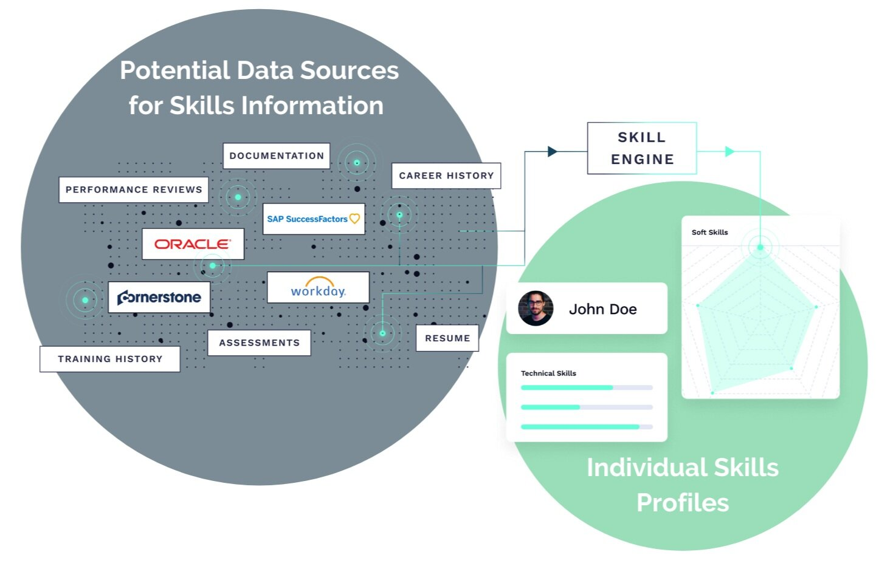
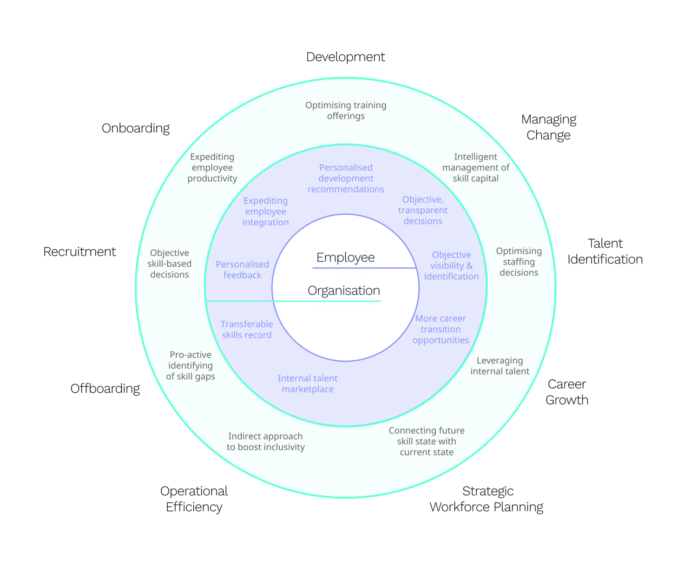

```{r setup, include=FALSE}
knitr::opts_chunk$set(echo = FALSE)
```


```{r image0, echo=FALSE, fig.cap="Photo by [Alex Kotliarskyi](https://unsplash.com/@frantic) on [Unsplash](https://unsplash.com/).", out.width = "100%"}
knitr::include_graphics("employeeskilldata_files/alex-kotliarskyi-QBpZGqEMsKg-unsplash.jpg")

```


Lachlan, a people analyst at a global company, sits down with the organisation’s Chief Strategy Officer (CSO). The CSO quickly gets to the point, stating: “Lachlan, I need your help finding a specialist to head up a new business. The opportunity is ripe—so we need to get started as soon as possible. By the end of the week, I need you to have identified a leader with the following skill set: experience in front- and back-end development, working knowledge of Amazon Web Services (AWS), knowledge of the South East Asian IT market, and fluent in Mandarin. We’ve got roughly 60,000 global employees, so surely there must be someone who fits the bill—right?”.

Lachlan pauses for a second before responding: “I honestly don’t know. I can certainly reach out to some contacts and look at the different datasets that we have internally, but I’m not 100% certain that I can find someone with the precise skill set that you’re looking for”. 

The CSO frowns and purses her lips. “Okay, well how about externally? Can you find me someone from outside the company?”. Upon hearing this, Lachlan immediately looks relieved, replying: “Definitely—I can give you a detailed shortlist of specialists by close-of-business tomorrow. Would that be okay?”. The CSO smiles and nods, before adding: “How is it though that you can’t find me someone from our global internal population of 60,000, but you can provide me a list of people in 24 hours among a global population of approximately 8 billion people?” 

Lachlan pauses, considering the problem at hand. After a few seconds, he responds simply: **“Well, it’s all down to the quality of data at my disposal”**.

This anecdote illustrates a common problem among companies of all sizes—most organisations are unaware of the skills residing within their employee population. The notion of employee skill data has garnered considerable interest of late, with interested parties ranging all the way from: 

* **Tech-savvy vendors** looking to apply rapidly advancing Artificial Intelligence (AI);

* **People analytics professionals** wrestling with a variety of challenges;

* **CHROs** looking to provide a personalised employee experience at scale; 

* **Chief Learning Officers (CLO’s)** looking to provide a tailored learning offerings to employees; and

* **Talent Acquisition heads** looking to mobilise a greater number of internal transfers through a Talent Marketplace.

So what unites these disparate parties? Well, it’s ultimately the realisation that old skills management practices—specifically, an inability to catalogue the “gold” within the organisation—is untenable.

This article explores the two fundamental considerations when it comes to skills management. First, how do you acquire your employees’ relevant skill data? Second, what practical value can you then generate from this wealth of information?


## How to Acquire Employees’ Skill Data

The introductory anecdote highlights one key issue: an employee skills catalogue entirely depends upon quality data. So how about asking individual employees to complete and maintain their own employee skills profile (i.e. a company-specific profile similar to LinkedIn)? 

For starters, this is unsustainable. Employees might forget to update their profile, feel like they’re too busy, or simply not see the benefits of this activity. 

As a result, organisations must:

* Minimise the amount of effort needed from each individual employee.

* Fully exploit existing data as intelligently as possible.

* Generate clear-cut benefits for both individuals and wider organisations alike.

And it appears that advancements in AI—specifically Natural Language Processing (NLP)—might hold the key. NLP has already been used widely within the HR industry, especially in the field of Talent Acquisition. This technology, when used correctly, connects and distils numerous data sources to make previously unknown connections.

For example, the following data sources—while often scattered across the HR / IT landscape and laying dormant—already contain a wealth of valuable information about individual employees.

* **Recruitment data**: Resumes, cover letters, assessments, etc. 

* **Career history data**: Roles previously held by individuals within an organisation, role titles, job descriptions, project descriptions, leadership roles, awards won, etc.

* **Learning & Development data**: Courses undertaken and completed, development objectives, mentoring, certifications, 360-degree feedback, psychometric assessments, etc.

* **Performance data**: Performance objectives, performance appraisals, written feedback by peers and stakeholders, etc.

* **External data**: Professional networking sites, professional publications, patents, blogs, etc.

All of these sources (well, all aside from external data) have long been standard data collection mechanisms within the HR industry. If finance is considered the home of numbers-based insights, then HR is undoubtedly the home of text-based insights. Organisations can therefore automate the engineering of skill data by combining:

The various forms of employee data currently held in disparate organisational HR/IT systems.

Next-generation NLP technologies that can perform realistic interpretations of text-based data. 


```{r image1, echo=FALSE, fig.cap="Visual representation of the process of automating 1. Ingestion of employee data currently in organisations, and 2. Interpretation of content via NLP to develop realistic skill profiles.", out.width = "100%"}


```


The above image visually demonstrates this process. By analysing and applying relevant skill data, organisations can achieve evidence-based decision-making when it comes to personnel matters. Needless to say, this brings considerable value to both individual employees and the broader organisation.


## The practical value you can generate with skill data across the employee lifecycle

It’s all well and good acquiring relevant skill data, but how can it be put to good use? If used correctly, skill data can guide a wide variety of employee touchpoints within an organisation. For instance, [the very process of identifying the right person for a specific role](https://www.myhrfuture.com/blog/2020/7/16/how-companies-are-using-talent-marketplaces-to-promote-internal-mobility) (as per the introductory example) is a foundational application of employee skill data. 

### Figure: Overview of where skills data can be used for both employee and organisation

The following diagram gives an overview of the areas where skills data can be put to good use for the advantage of the organisation and the advantage of the employee.


```{r image2, echo=FALSE, fig.cap="Overview of the areas where skills data can be put to good use for the advantage of both the employee and organisation.", out.width = "100%"}


```

### Table: The benefits of skills data for both employee and organisation

The following table lists several other potential applications, both from the perspective of the employee and the organisation. 

Employee Lifecycle Stage | Employee Value | Organisation Value
--- | --- | ---
**Recruitment** | **Objective recruiting decisions that provide personalised feedback:** skills are inferred from application data sources (e.g. CV, LinkedIn, etc.) and skill-based matches are provided to the recruiter as an additional lens. As a result, objective and tailored feedback can be provided to unsuccessful candidates (i.e., no more generic “unsuccessful” emails from organisations), which can help them take future action, e.g. upskilling or tailoring their job search. For successful candidates, the inferred skills captured can be used to personalise the onboarding process. | **Objective skill-based recruiting decisions:** skills can be inferred from a previous role incumbent and/or data sources that describe the role (e.g., job description, performance objectives, etc.). The vacancy is then more accurately described in terms of objectives and required skills. This provides greater accuracy for candidates and the organisation, thereby improving recruitment outcomes, saving time and money. Furthermore, the influx of skills into the organisation can be captured and subsequently analysed for trends and insights. Are critical skills being recruited at an adequate pace? Which skills are difficult to source and should be built?
**Onboarding** | **Expediting employee integration:** new employees are immediately included in the employee skill catalogue. This enables the immediate personalisation of learning recommendations, mentoring opportunities, and inclusion in organisational projects. Moreover, because expertise is immediately captured, employees can play an immediate role as SME’s where applicable. This enables value contribution and subsequently engagement and satisfaction, which may otherwise take months to establish. | **Expediting employee productivity:** including employee skill details in the organisational catalogue expedites the speed with which new employees can be included in work deliverables, improving employee time to productivity. In addition, skill gaps between the vacancy and candidate are assessed automatically, thereby enabling faster closure of skill gaps through training and mentor recommendations.
**Development** | **Personalised employability assessment and development recommendations:** skills data helps to compare each employee to both the internal and external environment to determine their employability. Employees can undertand how desirable their skillset is, which in turn becomes a great motivator for learning. Organisations are better equipped to provide personalised learning recommendations to employees, based on their current skills and market skill trends. Finally, by tying learning recommendations to opportunities within the company (also known as talent markeplace), employees can explore new avenues for career growth. | **Optimising training offerings:** Organisations can make more objective and intelligent decisions regarding their Learning System investments, by answering questions such as: How closely does a system mirror the skills an organisation currently has, and will need in future? Does a system mirror skill trends in the different geographic markets, or just one market? How are new training offerings prioritised by the provider and will this mirror future skill requirements of the organisation? Secondly, organisations can make more effective Strategic Workforce Planning decisions regarding which skills are “built” vs “bought”. Thirdly, organisations can compare employee skills to external market trends. This transparency, when shared with the workforce, can help to facilitate a culture of learning.
**Talent Identification** | **Objective visibility and identification of talent (i.e., non-political) that enables better employee experiences:** skill based identification surfaces better employee opportunities for awards and recognition, funding opportunities, project sponsorship, project involvement, skill and career growth, and learning programs (e.g., high performer investment, university course sponsorship, etc.). | **Optimising staffing decisions:** rapid identification of resident skills facilitates more effective project staffing, team configuration and ultimately organisational design. An employee skills catalogue enables decision making at scale. Better staffing decisions can directly impact innovation and productivity outcomes. The employee skills catalogue enables greater ease and precision of talent (e.g., who has skills of greatest organisational value), internal job mobility and succession.
**Career Growth** | **Greater career transition opportunities:** A skills-based talent marketplace enables employees to determine how transferable their skills are to other roles in their local or global organization. Which roles are currently open that an employee could transition into? Which roles are realistic career growth opportunities? | **Leveraging internal talent to maximum benefit:** many organisations find it easier to identify and source talent externally than internally. By creating a skills-based talent marketplace, organisations can leverage the employee skills catalogue to identify and source talent with corporate knowledge, expediting onboarding. Moreover, enabling employees to easily identify opportunities internally may facilitate longer careers within organisations, thereby reducing turnover and the costs associated with recruitment, onboarding, etc.
**Managing Change** | **Increasingly objective, and transparent decisions with personalised feedback.** Skill based decisions provide all employees with visibility during change, not just those who are well-networked. Decisions can be made in a way that systematically consider current state, SWP, employee skill utility, and thereby provide individual feedback in a transparent and valuable fashion. | **Objective and intelligent management of skill capital during change.** A skills catalogue may inform the due diligence process (i.e., what are we acquiring), retention (i.e., which skill sets represent a unique value-add), and the post-sale integration process (i.e., configuring new organisations or project teams). Organisations can systematically determine the skills each employee provides the workplace as well as understanding, during times of restructure, which skills are being lost or gained during various change scenarios. This affords organisations an opportunity to remove some of the uncertainty associated with change.
**Strategic Workforce Planning** |  | **Connecting the future skill state with the current skill state.** It is impossible to effectively work toward a future state skill target, without knowing which skills are currently resident within the organisation. Such understanding will inform build or buy skill decisions and learning investments.
**Operational Efficiency / Knowledge Management** | **Finding help (i.e., skills, corporate knowledge, resources, etc.) through an internal talent marketplace.** Who has the skills related to my project(s) who may not be within my current network of contacts? Has something similar been done before? Having a transparent view of the skills across the workforce means that employees can connect with others who have expertise more effectively thus proactively catalyzing innovation and productivity. Employees no longer have to wait to “hear” about new communities of practice in an information-overload environment | **An indirect approach to knowledge management and talent management** can boost inclusivity across the workforce as more informal and formal network connections are facilitated. In turn, the impact of a more transparent, inclusive approach to the workforce could have significant impacts on developing the right culture at your organisation.
**Offboarding** | **A transferable skills record that promotes employability:** Leaving an organisation with a systematic, objective and comprehensive assessment of skills enables individual employability. Moreover, this benefit would ideally engender goodwill between ex-employee and organisation, encouraging advocacy and loyalty, and provide a skill passport that could readily enable future re-employment. | **Identifying skills gaps before they are felt:** The outflow of skills in the organisation can be captured and subsequently analysed for trends and insights. Are any critical skills leaving the company? How are departing skills being addressed by Talent Acquisition, Career Mobility and L&D activities?


The above list, while not exhaustive, illustrates the various ways in which skill data can underpin many major employee touch points within an organisation. The greatest benefit of skill based personnel decision making is that it provides an objective, comprehensive, and close to real time perspective of the organisation - an outcome previously beyond the reach of organisations. 


## Why skills could be the new business currency

Skills management has been around since the eighties. However, it has historically been complicated, highly resource-intensive, and, even worse, yielded questionable tangible value to the organisation as a whole. 

But that’s all about to change. Technological advancements mean that organisations can identify and manage their employees’ skill sets more easily than ever before. The above discussion detailing prospective applications of skill data demonstrates the breadth of utility, and potential for objective enhancement of personnel decision making across the employee lifecycle. Moreover, skill data provides a globally universal currency for organisational decision making, thereby enabling personalised employee decision making at scale that transcends geographic boundaries.

By maintaining a continuous overview of the capabilities that lie within their organisation, they’ll be able to meet the future head-on—no matter what challenges they face.


## Acknowledgments {.appendix}
This article was first published on the myHRfuture website under the title ["The Value of Measuring Employee Skill Data"](https://www.myhrfuture.com/blog/2020/11/24/the-value-of-measuring-employee-skill-data) on November 25th, 2020.

