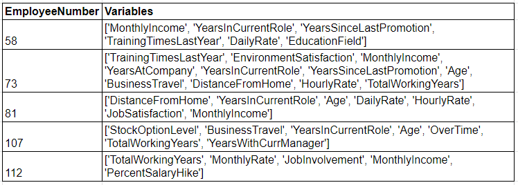

```{r setup, include=FALSE}

knitr::opts_chunk$set(
  warning = FALSE,
  message = FALSE,
  comment = "##",
  out.width = "100%",
  out.height = "100%",
  dpi = 300,
  R.options = list(width = 70))

```


```{r header, echo=FALSE, fig.cap="Photo by [Mika Baumeister](https://unsplash.com/@mbaumi) on [Unsplash](https://unsplash.com/).", out.width = '100%'}

knitr::include_graphics("../2022-07-22-isolationforests/mika-baumeister-Wpnoqo2plFA-unsplash.jpg")

```


# Introduction

The topic of data quality is like that of I.T. services generally… you only ever hear about it when there’s a problem! There’s an implicit assumption among stakeholders receiving the findings of people analytics initiatives that your data is “good”. Failure to observe this assumption of high data quality can significantly (and rapidly) undermine the credibility of findings, irrespective of how small the data quality deviation! 

From an analytical perspective, the quality of your insights can potentially be limited by flawed data. As the saying goes “garbage in, garbage out”. Coupled with stakeholder expectations, it becomes increasingly important that organisations invest time and energy in the ongoing assessment and curation of quality data to maximise the influence of data driven decision making in organisations.

At the same time, monitoring data quality in HR can be immensely time consuming, expensive, simplistic in execution (i.e., simple evaluation criteria such as age ranges), highly repetitive, and utterly devoid of ANY professional enjoyment! To overcome these shortcomings, we have developed an automated, multi-dimensional and scalable approach to data quality evaluation using unsupervised machine learning—Isolation Forests. 

# The Process

We used Isolation Forests, an [unsupervised machine learning](https://www.adam-d-mckinnon.com/posts/2020-06-19-a-beginners-guide-to-machine-learning-for-hr-practitioners/) approach to scan employee data for potentially anomalous[1] records. 

Our code can be viewed at [this GitHub account](https://github.com/MarthaC-SBP/IsolationForrest_HR_data_anomalies), which followed the following process steps:

1. Ingested personnel data and loaded the appropriate libraries. In our example, we used the IBM HR Attrition dataset, then installed the H2o and Pandas libraries.

2. Defined the dataset columns to include in the data quality assessment. Trained an Isolation Forest algorithm on the data. The Isolation Forest algorithm partitioned data through a forest of decision trees. Each split of the data was made randomly and the number of splits required to isolate a record indicated whether or not the record was considered anomalous. When a forest of random trees collectively produced shorter path lengths for particular records, they were highly likely to be considered anomalies.

3. Using the trained Isolation Forest model, we then predicted which records we believed to be anomalous. Of those records predicted to have data quality issues we then narrowed down to those with the highest likelihood of being anomalous using characteristics from the trained model.

4. The model has two levels of output interpretation: 
    i. Global – which dataset columns are most often related to data quality errors. At best this is interesting in identifying potentially systemic errors, which may be a catalyst for more controlled data entry parameters. 
    ii. Local – for any given record why is it deemed an anomaly. It is this level that is most valuable in directly resolving data quality issues, and therefore, was the focus of our approach. 

5. For those records deemed highly anomalous (our subset), we then trained a simple Random Forest model to predict the anomaly flag(s). This process was repeated multiple times for each record to increase our certainty in identifying those variables contributing to its anomaly status. Note: We kept the model simple to make identification (and interpretation) of the combination of variables contributing to each records anomaly status easy to perform. In short, we wanted the output interpretable by a wide audience, not just those familiar with machine learning outputs. 

6. The generated output (see excerpt of output in image below) has two fields: 1. A unique identifier, and 2. A list of variables contributing to each records anomaly status. The unique identifier, in our case the unique Employee Number taken from the original dataset, is critical to enabling identification and access to the original record that requires review. The second column has a ranked list (ranked from most important to least) showing the variables "collectively" contributing to the anomaly status. For example, when inspecting EmployeeNumber 58's record we see a Monthly Income only four times their DailyRate (possibly incorrect), and that the individual has been with the company 2 years, had their last promotion 2 years ago, and has 2 years in their current role, which collectively cannot all be correct–the algorithm suggests reviewing YearsInCurrentRole.


```{r costs, echo=FALSE, fig.cap="Example Output.", out.width = '100%'}

```


# Conclusion:

Unsupervised Machine Learning algorithms such as Isolation Forests can be an excellent way of automating and scaling the review of data to monitor for quality concerns. The approach lends itself to those datasets that have a reasonable level of data quality and that are looking to make further improvements.

The major advantage of this approach is that the Isolation Forest can identify a record as anomalous, despite no one variable in the record being out of acceptable limits. Instead, the algorithm assesses the combination of multiple variables to determine if the combination makes it seem anomalous. This is like having human intelligence review each record quickly, at scale, and without destroying anyone’s job satisfaction! 

We propose that this approach has the potential to significantly reduce time spent on direct data quality evaluations, which has considerable direct benefits (i.e., better quality data, more representative analyses and interpretation, etc.) as well as indirect benefits (i.e., time can be spent on other value-add initiatives that can only be done by humans!). This is particularly true for smaller teams, where the need to do more with less is greatest. 
