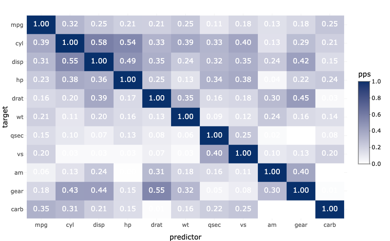

```{r setup, include=FALSE}

knitr::opts_chunk$set(
  echo = TRUE,
  warning = FALSE,
  message = FALSE,
  comment = "##",
  out.width = "100%",
  out.height = "100%",
  dpi = 300,
  code_folding = TRUE,
  R.options = list(width = 100))

```


```{r header, echo=FALSE, code_folding = FALSE, fig.cap="Example PPSR matrix using mtcars dataset", out.width = '100%'}


```


```{r loading_libraries, include=FALSE}

# data manipulation
library(tidyverse)
library(janitor)

# Data Exploration
library(ppsr)
library(correlationfunnel)
library(DataExplorer)

# Visualisation addition
library(plotly)


```


```{r loading_data, include=FALSE}

# Load Data ----
promotions_tbl <- readr::read_csv(file = "train.csv") %>% 
    janitor::clean_names()

# reduce the dataset size
cleaned_promotions_tbl <-
promotions_tbl %>%
    tidyr::drop_na() %>% 
    mutate(
        is_promoted = as.character(is_promoted),
        is_promoted = if_else(is_promoted==1, "Yes", "No") %>% as.factor()
           )

```

# 1. Predictive Power Score

```{r ppsr}


cleaned_promotions_tbl %>%
    select(-employee_id) %>%
    visualize_pps(y = 'is_promoted', do_parallel = TRUE)


```

# 2. Correlation Funnel

```{r correlation_funnel, fig.height=0.85}


cleaned_promotions_tbl %>% 
    select(-employee_id) %>% 
    binarize() %>% 
    correlate(target = is_promoted__Yes) %>% 
    plot_correlation_funnel(interactive = TRUE) %>% 
    plotly::config(displayModeBar = FALSE)
    


```

# 3. DataExplorer

```{r dataexplorer, include=FALSE}

xaringanExtra::use_panelset()

```


::::: {.panelset}

::: {.panel}
[Default Heatmap]{.panel-name}


```{r default_heatmap, echo=FALSE, code_folding = TRUE, fig.height=6.5}

corr_plot <- cleaned_promotions_tbl %>% 
    select(-employee_id) %>% 
    DataExplorer::plot_correlation(
        theme_config = list(
            legend.position = "none",
            axis.text.x     = element_text(angle = 90)
                )
    )

```


:::

::: {.panel}
[Interactive Heatmap]{.panel-name}


```{r interactive_heatmap, echo=FALSE, code_folding = TRUE, fig.height=750}

corr_plot$data$value <- round(corr_plot$data$value, digits = 2)

plotly::plotly_build(corr_plot) %>% 
    plotly::layout(width = 700, height = 700) %>% 
    plotly::config(displayModeBar = FALSE)

```

:::

:::::
