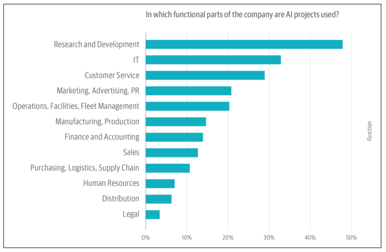
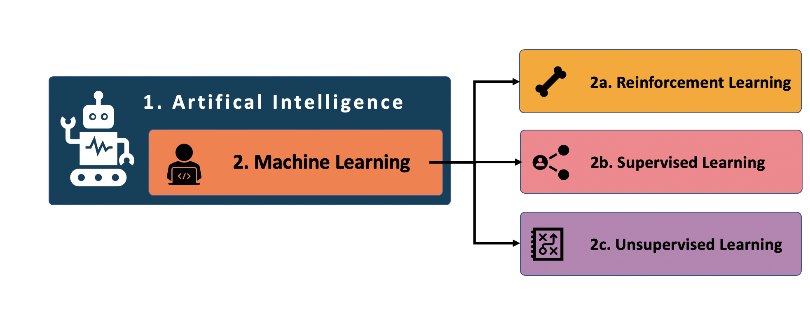
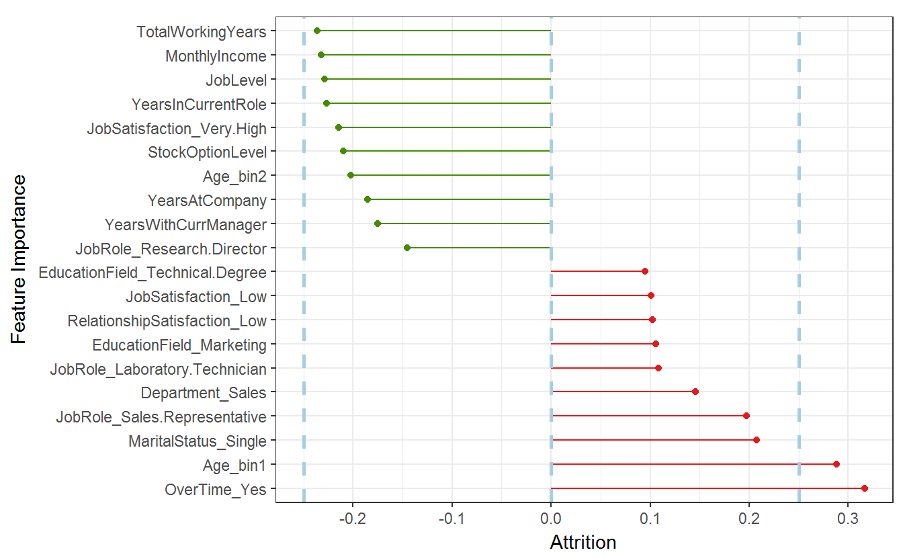
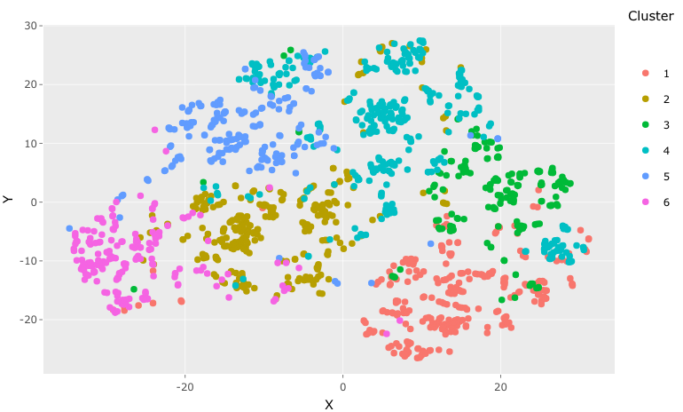

```{r setup, include=FALSE}
knitr::opts_chunk$set(echo = FALSE)
```

```{r image0, echo=FALSE, fig.cap="Image by Pietro Jeng on Unsplash.", out.width = "100%"}
knitr::include_graphics("welcome_files/pietro-jeng-n6B49lTx7NM-unsplash.jpg")
```


When you hear Artificial Intelligence (AI) the first thing that comes to mind are robots; in particular, the Steven Spielberg movie titled A.I. where a robot child is built that can love and behave just like a real human. This idea appears to be closer to a dream than reality. Truth is, AI is more ubiquitous than we might think. It ranges from self-driving cars, movie recommendations on Netflix, e-mail spam detection to voice-controlled assistants such as Apple’s SIRI. The fact is that AI is already present across many businesses and various industries, as is shown in the figure below (Note the low adoption rate in Human Resources).

```{r image1, echo=FALSE, fig.cap="Image source: Where AI projects are being used within companies. From AI Adoption in the Enterprise, Magoulas, R. & Swoyer, S. (2020).", out.width = "100%"}

```


Still, evidence suggests that HR departments remain unable to seize the multitude of opportunities associated with AI. In part, what may be required to accelerate the adoption of AI is educational content directed at HR Professionals, not data scientists. Thus, we offer this brief guide to Machine Learning (ML), an important subset of AI, with the intent to demystify ML and make it tangible. 


# What is AI?
Let’s start with the definition. AI is a broad area of computer science with the focus on building machines that can behave in an intelligent way—akin to humans. Furthermore, we can differentiate between 1. Generalized AI and 2. Specific AI. The concept behind Generalized AI is to develop machines that can perform multiple tasks, just like Spielberg’s robot-child. This is an area still in its infancy. 

More relevant to HR is Specific AI, which refers to the use of intelligent machines to perform only one particular task, but to do it better than a human could (e.g. faster, more accurately, or objectively). For example, an application that reads hundreds of CVs in seconds and identifies optimal candidates for an interview—thereby affording HR professionals greater time to perform tasks humans do better than machines (e.g., building rapport, empathy, creativity, critical thinking, etc.).


# What is Machine Learning?
But how can a machine be programmed to process information (i.e., data) in an intelligent way? The answer to that is Machine Learning (ML). ML is a subset of Specific AI that comes from a mix of statistics and computer science. It refers to the process of computers learning to perform a task instead of following step-by-step instructions. This is generally performed iteratively by data scientists instructing a computer if its decisions are correct or incorrect. Depending on the outcome, the computer adapts how it makes decisions in the future—in other words, “it learns”. 


```{r image2, echo=FALSE, fig.cap="The relationship between AI, ML and the three broad types of ML.", out.width = "100%"}

```

When it comes to ML there are basically three broad types:

1. Reinforcement Learning,

2. Unsupervised Learning, and

3. Supervised Learning.

## 1. What is Reinforcement Learning?

Reinforcement Learning is probably best known through IBM’s Deep Blue computer, a “robot” that learned how to play chess and beat the human world champion. 

Reinforcement Learning is a type of technique that enables an algorithm to learn by trial and error, using feedback from its own actions and experiences. Much like Pavlov and his dog, Reinforcement Learning involves rewarding decisions that lead to success and penalizing decisions that lead to anything other than success—ultimately making the algorithm more intelligent in the process. 

Examples of reinforcement learning applied in HR are a bit lean, though are most prevalent in areas such as education (i.e., applying content based on the progress of the student), finance and investment (i.e., advanced forecasting), supply chain operations (i.e., robots fulfilling orders in a warehouse), traffic flow optimization, and healthcare (i.e., accurate classification of biopsy images).


## 2. What is Supervised Learning?
The most common forms of ML across industries, and specifically the HR domain, are Supervised Learning, followed by Unsupervised Learning. 

In Supervised Learning, we try to predict an outcome, such as whether an employee will leave the company, the risk of an employee being injured, or the ideal starting salary of a new employee. 

To make predictions we need different input variables (i.e., variables are called “Features” by data scientists). Our input features are only limited to our imagination (i.e., what we think will be important), what data we can get our hands-on, or what data we can create (e.g., by knowing where someone works and where they live we can create a variable focused on employee commute distance).

### An example: Supervised Learning informing Employee Turnover

Let’s examine a more detailed example of Supervised Learning—predicting who will leave an organization. Imagine that 1 in 5 new recruits leaves an organization in their first 12 months of tenure. To prevent such turnover, we could build a supervised learning model that predicts the likelihood of new starters leaving, so that our HR and managerial colleagues could intervene. 

In this example, the model outcome being predicted is turnover risk, and the features used to predict turnover risk could include an employees’ demographic and employment characteristics (e.g., age, education level, role level, pay relative to market, month of employment, presence of development plans, and so on.).

Assuming such a model was highly accurate, it would enable us to understand turnover among our new starter population from three angles. 

1. Firstly, what are the factors most influential in predicting turnover among our population. An example of such a model output is presented in the figure below, which illustrates whether a feature prevents turnover (green bars) or promotes turnover (red lines), and the relative importance of each feature in predicting turnover (i.e. longer lines denote more importance). 

2. Secondly, the model also rates the likelihood of each new starter leaving the company, enabling focused intervention (i.e. the risk that Adam will leave in his first 12 months). 

3. Thirdly, the model identifies the features preventing or promoting turnover risk for each employee. This individualized output can enable HR professionals to take informed and personalized action, regardless of whether they personally know each employee. 

```{r image3, echo=FALSE, fig.cap="Example output from a model that predicts employee turnover risk. The plot describes the relative importance and directional influence of features in the model. Red bars represent features that contribute to employee turnover risk, while green bars represent features preventing turnover risk.", out.width = "100%"}

```


A supervised learning model used to predict employee turnover among new starters has the potential to reduce notable costs, including financial (e.g., separation, vacancy, recruitment, training, and replacement) reputational (e.g., eroding an EVP and/or reducing candidate appeal) and productivity-related (e.g., on average organizations invest between four weeks and three months training new employees). Some of these costs can be readily quantified so that we can identify organizational savings based on prevented turnover (e.g., preventing 2 in 10 resignations saves $xxx). 


## 3. What is Unsupervised Learning?


Unlike Supervised Learning where we are trying to predict an outcome, Unsupervised Learning analyzes many variables simultaneously to identify similarities, patterns or relationships in the data. Unsupervised Learning is more about understanding what’s in the data. The two most common uses of unsupervised learning are focused on:

* Clustering: automatically splitting the dataset into groups based on similarities among the features analyzed. Classically applied to consumers, but equally relevant to organizations, whereby we understand our employee segments (i.e., clusters) and determine whether our HR policies serve the segments.

* Association mining: identifies sets of variables that often occur together in your dataset. For example, identifying injury patterns among workers at specific sites.

### An example: Unsupervised Learning informing Employee Turnover

Cluster Analysis, the most famous form of unsupervised learning, can also help us better understand employee attrition. This approach can help group employees based on similar features (e.g., location, tenure, nationality, education level, age, performance level, etc.). 

The figure below depicts the results of an analysis of the employee’s demographic features. Multiple demographic features are first reduced to two dimensions using a method called Manifold Learning (another non-supervised method), and these two new dimensions are then clustered using a method called T-SNE. The figure below shows us how the employees can be grouped together, in this case, twelve clusters, based on their demographic features. 


```{r image4, echo=FALSE, fig.cap="An example cluster analysis output when applied to employee features.", out.width = "100%"}


```


Once grouped into clusters, the next step is to determine the risk of turnover for each group. Moreover, it is interesting to identify if there are some shared risk factors, practically indicating that employees within a cluster are experiencing the workplace in a similar way. 

This last insight is of considerable practical significance, as it may help us tailor interventions that target specific employee clusters, thereby delivering maximum impact (i.e., retaining employees and reducing turnover costs) and return on our investment (i.e. for every $ spent we generated $xxx in savings from reduced turnover). 


# Conclusion

We have begun to open the black box that is AI, providing a simple overview of ML. We looked at three broad types of ML—reinforcement, supervised and unsupervised—and examined some simple applications of each, where possible related to Human Resources. It is our genuine belief that through greater knowledge of what is possible with ML, HRBP’s and organizational decision-makers will both expect more, and be willing to do more, in this technological domain. Our next piece will explain the step-by-step process for performing Supervised ML—making discussions with People Analytics teams more tangible and less abstract!

